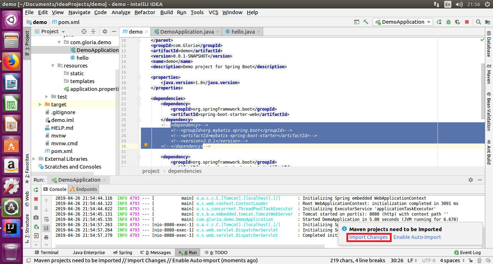
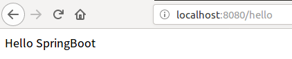

### SpringBoot+MyBatis实现后端增删改查功能

#### 第1章 项目设计及框架搭建

本章节讲解项目的需求分析、数据库设计以及后端SpringBoot + MyBatis框架的搭建

- 1-1 SpringBoot的搭建与启动上
- 1-2 SpringBoot的搭建与启动下
- 1-3 功能点的明确 
- 1-4 表设计与实体类的创建

#### 第2章 项目开发

本章节从零开始从Dao到Controller开发一个完整的带单元测试增删改查后端。

-  2-1 pom的配置
-  2-2 mybatis-config的配置
-  2-3 datasource和sessionfactorybean的配置
-  2-4 dao的创建
-  2-5 mapper的编写
-  2-6 dao层开发
-  2-7 service层的实现
-  2-8 业务controller方法的实现
-  2-9 统一异常处理功能的实现

#### 出现的常见问题：

1.当更改pom文件中的配置后，可以点击右下角出现的实现jar包的更新，包括增加和删除。

2.在浏览器地址栏中输入如下地址，出现如下显示说明SpringBoot启动成功，注意验证SpringBoot启动时先把pom里面的关于MyBatis的dependency注释掉。

3.注意数据库新建表的时候，列名的两个引号不是单引号，而是反引号，在键盘左上角的位置

4.程序运行报错时，首先看控制台上的输出消息，优先找“cause”附近的提示，一般是出错的原因

5.POST方式时传入参数的地址示例：http://localhost:8082/demo/superadmin/getareabyid?areaid=1

课程来源：慕课网